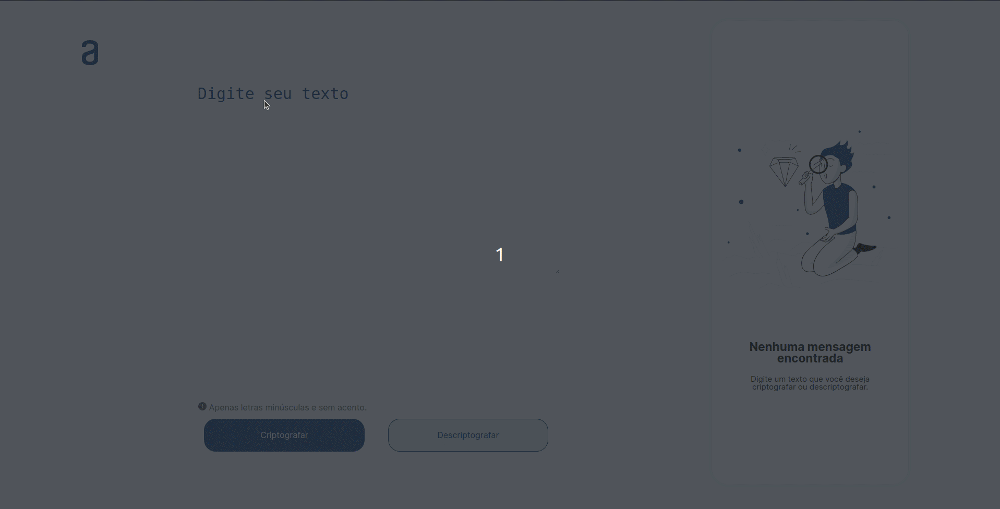

# Decodificador

Esse projeto consiste em um decodificador de textos, desenvolvida com html, css, js.

## Demonstração

<p aling="center">
  
</p>

## Rodando localmente

Clone o projeto

1. Clone o projeto

```bash
  git clone git@github.com:JonasTiago/Decodificador.git
```

2. Entre no diretório do projeto

```bash
  cd Decodificador
```
